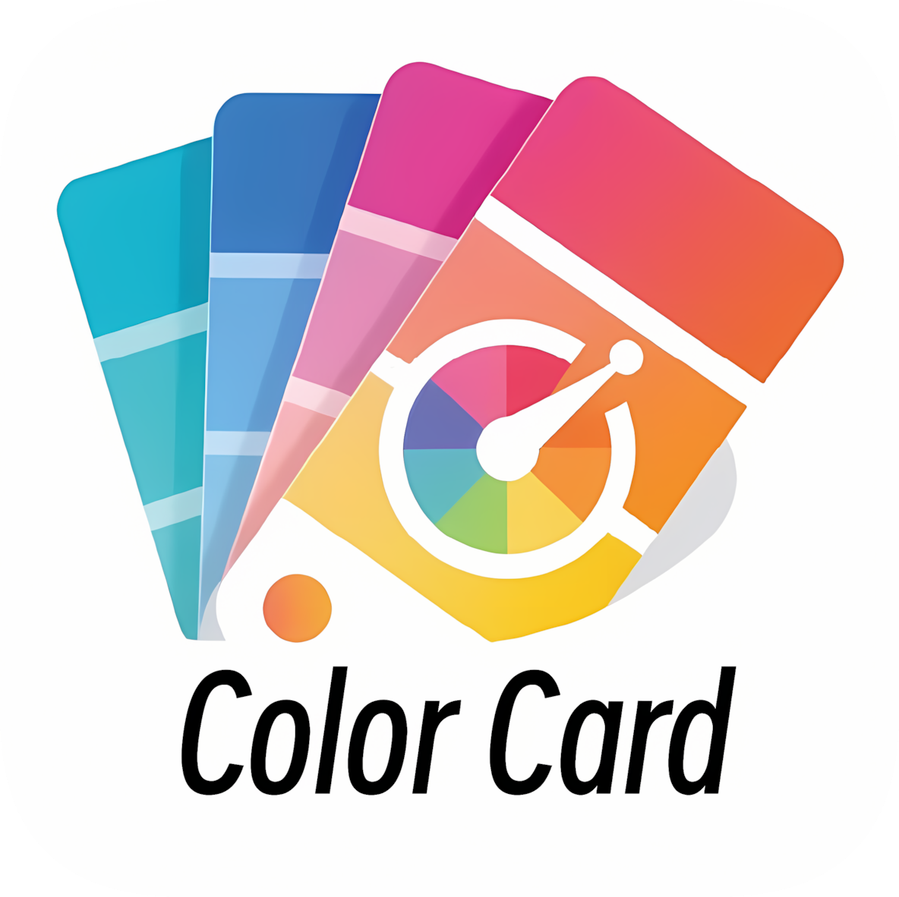
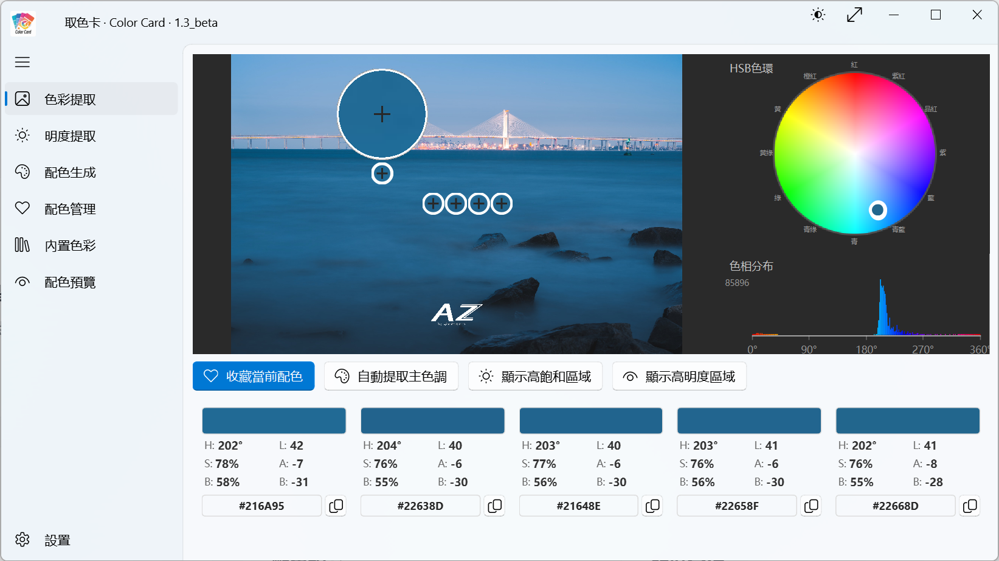
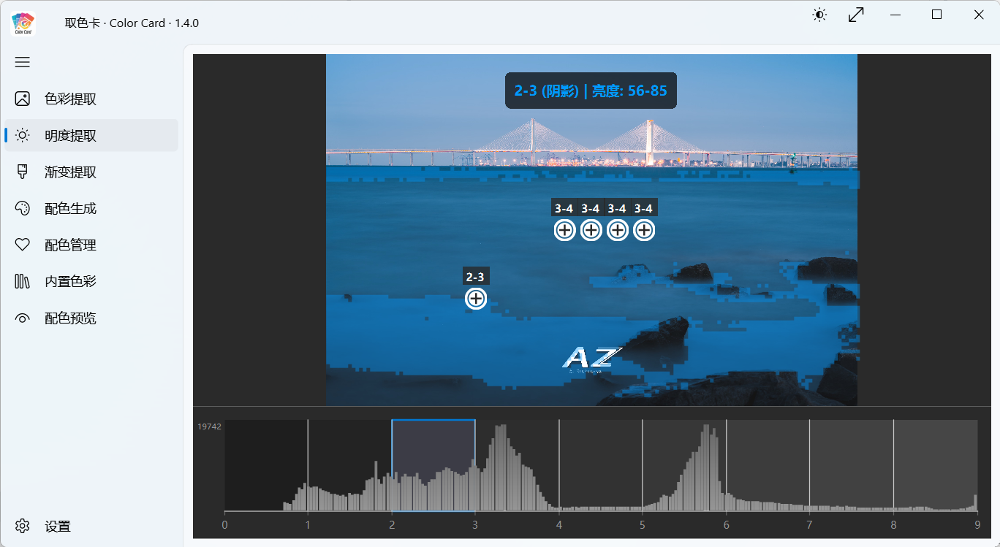
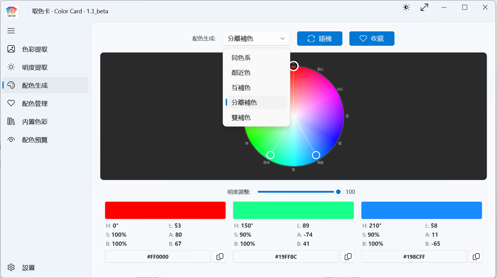
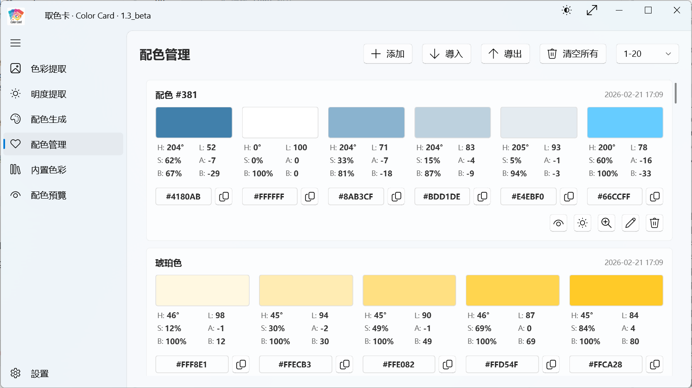
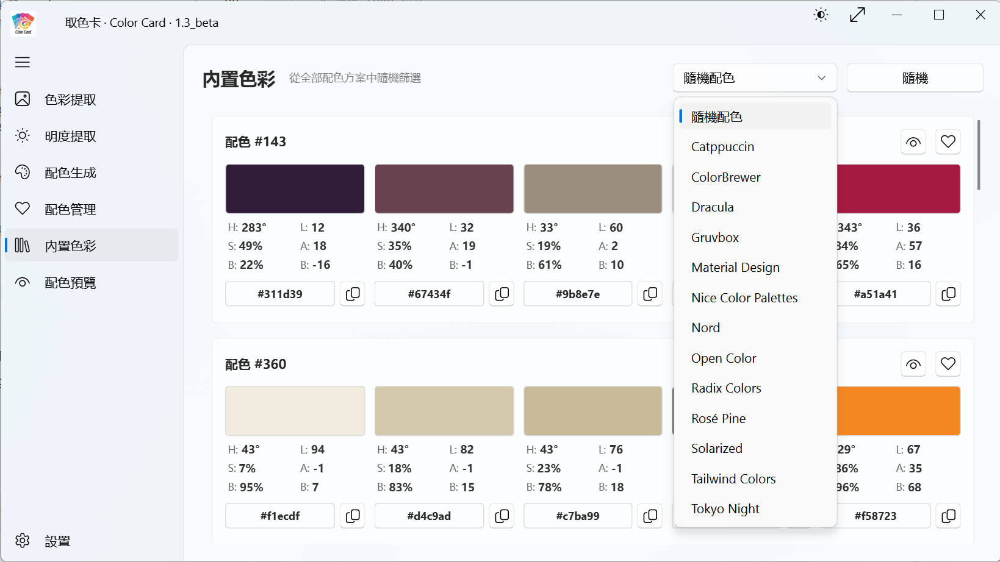
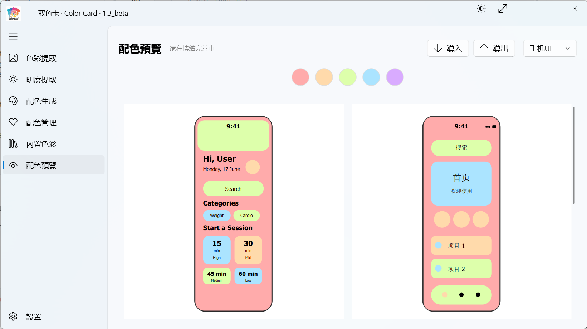
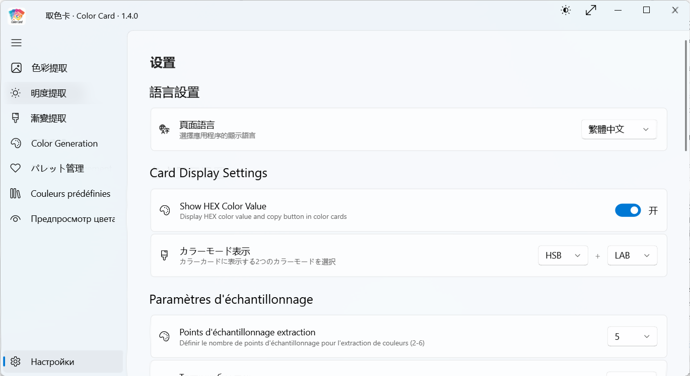

<p align="center">
  
</p>

<p align="center">
  <b>为摄影师和设计师打造的一站式配色工具和图片色彩分析工具</b>
</p>

<p align="center">
  <a href="#中文版">简体中文</a> | <a href="#english-version">English</a>
</p>

***

<a name="中文版"></a>

## 项目概述

**取色卡（Color Card）是一款专为摄影师和设计师打造的一站式配色工具和图片色彩分析工具**，集成了图片色彩信息提取、明度分析、配色方案生成、渐变色生成、配色管理、配色预览等全方位功能。本工具基于 PySide6 和 PySide6-Fluent-Widgets 开发，提供了现代化的流畅界面，帮助用户快速获取图片的色彩数据并生成专业的配色。

**开发理念**：在摄影后期处理和设计创作中，色彩分析是一个重要环节。摄影师可以通过分析优秀照片的色彩和影调来提升自己的拍摄和后期水平，而设计师则可以直接从照片中提取相应的色彩，直接运用到设计中。

不同与常见的色彩工具或网站，只提供一种功能——取色卡就是为摄影师和设计师提供一个简单、直观的一站式色彩工具，从图片中提取颜色、分析明度分布、生成配色、生成渐变色、管理配色、预览配色效果，满足从色彩分析到配色应用的全流程需求。

**关于本项目**：取色卡是借助 AI 编程工具（如 Trae 等）开发的**非商业开源项目**。项目功能设计借鉴参考了 [Adobe Color](https://color.adobe.com/)、[色采](https://www.wxsecai.com/) 、[palettemakel](https://palettemaker.com/)等优秀的在线配色工具，为用户提供一个**无需联网、无需注册、隐私安全、一步即达**的本地替代品。所有代码均为独立实现，与 Adobe 等公司无任何关联。

**开源协议**：本项目采用 **GNU General Public License v3.0 (GPL 3.0)** 开源协议，所有代码和文档均遵循该协议的条款和条件。

**开源地址**：

- **主仓库（Gitee）**：<https://gitee.com/qingshangongzai/Color_Card>
- **镜像仓库（GitHub）**：<https://github.com/qingshangongzai/Color_Card>
- **官方网站**：<https://qingshangongzai.github.io/Color_Card/>

### 开发历程

自 2026-02-05 发布 v1.0.0 以来，项目保持快速稳定的迭代节奏：

| 指标    | 数据                      |
| :---- | :---------------------- |
| 发布版本  | 11 个版本（v1.0.0 → v1.7.1） |
| 开发周期  | 66 天                    |
| 总更新项  | **133 项**               |
| 平均每版本 | 12.1 项                  |

**详细分类统计**：

| 分类       |   数量   | 说明              |
| :------- | :----: | :-------------- |
| ✨ 新增功能   | **36** | 包含首次发布的 9 项核心功能 |
| 🔧 问题修复  | **32** | 持续修复 Bug，提升稳定性  |
| 🎨 界面优化  | **35** | 用户体验打磨          |
| ⚡ 性能提升   | **11** | 缓存机制、启动优化等      |
| 📝 内容调整  |  **5** | 文本、名称等调整        |
| ⚙️ 体验优化  |  **5** | 交互体验改进          |
| 🏗️ 代码优化 |  **2** | 代码结构优化          |
| 🔮 逻辑优化  |  **2** | 算法逻辑改进          |
| 🖥️ 平台支持 |  **1** | Mac 版本适配        |
| 📜 许可证完善 |  **1** | 开源合规性           |
| 🚀 功能优化  |  **1** | 功能增强            |

### 核心功能特色

**一站式色彩解决方案**：从图片分析到配色应用，提供完整的色彩工作流

| 功能 | 截图预览 |
|------|---------|
| **色彩信息提取**<br>通过可拖动取色点实时提取图片颜色，支持多色彩空间显示（HSB、LAB、HSL、CMYK、RGB） |  |
| **明度分析**<br>将图片按明度分为9个区域（基于Adobe标准），提供直方图可视化，可快速分析图片影调 |  |
| **渐变色提取**<br>支持双色渐变和单色明度梯度两种模式，双色渐变通过起始色和结束色生成渐变色序列，单色明度梯度固定色相饱和度按明度分级生成色阶（类似 Tailwind 50-900），支持 RGB/HSB/HSL/LAB 四种颜色空间插值 |  |
| **配色生成**<br>提供5种专业配色方案（同色系、邻近色、互补色、分离补色、双补色），支持可交互色环选择 |  |
| **配色收藏**<br>支持收藏、管理配色方案，支持批量导入导出为JSON文件，支持单组色卡导出为 Adobe ASE 格式 |  |
| **内置色彩库**<br>集成 Open Color、Tailwind CSS、Material Design 等13大开源配色方案，总计661组色卡 |  |
| **配色预览**<br>支持手机UI、网页、插画、排版、品牌、海报、图案、杂志等8种场景预览，并支持导入自定义SVG |  |
| **多语言支持**<br>支持简体中文、繁体中文、英语、日语、法语、俄语等6种语言 |  |
| **现代化界面**<br>基于 Fluent Design 设计语言，支持深色/浅色主题切换 |  |

### 适用场景

**摄影师工作流**

- **摄影后期**：分析照片的色调分布，辅助调色决策，理解图片的色彩构成
- **色彩参考**：从优秀作品中提取配色，获取创作灵感
- **明度分析**：评估照片的明度分布，优化曝光和对比度

**设计师工作流**

- **设计配色**：从参考图中提取配色，快速获取设计灵感
- **配色预览**：在插画、排版、UI等多种场景下预览配色效果
- **色彩管理**：收藏和管理配色方案，建立个人色彩库
- **色彩研究**：学习理解不同图片的色彩构成，提升色彩感知能力

**综合应用**

- **跨场景协作**：摄影师和设计师共享配色方案，统一视觉风格
- **色彩教学**：作为色彩理论和实践的教学工具
- **快速原型**：快速生成配色并预览效果，加速设计迭代

***

## 安装指南

### 面向普通用户（使用安装包）

1. 前往项目的 **Gitee 发布页** 下载最新的安装包（Windows 为 `.exe`，Mac 为 `.dmg`）
2. 运行下载的安装程序，跟随向导完成安装
3. 从桌面快捷方式或开始菜单启动 "取色卡"

### 面向开发者（从源码运行）

#### 环境要求

- **操作系统**：Windows 10/11 64位 或 Mac（Apple Silicon）
- **Python 版本**：Python 3.11 及以上 64位版本（推荐使用 3.14）
- **内存**：推荐 4GB 以上
- **硬盘空间**：至少 100MB 可用空间

#### 依赖安装与运行

1. **克隆仓库**：
   ```bash
   # 从 Gitee 克隆（国内推荐）
   git clone https://gitee.com/qingshangongzai/Color_Card.git

   # 或从 GitHub 克隆
   git clone https://github.com/qingshangongzai/Color_Card.git

   cd color_card
   ```
2. **创建虚拟环境（推荐）**：
   ```bash
   python -m venv .venv
   # 激活虚拟环境
   .\.venv\Scripts\activate  # Windows
   ```
3. **安装项目依赖**：
   ```bash
   pip install -r requirements.txt
   ```
4. **启动应用程序**：
   ```bash
   python main.py
   ```

***

## 使用说明

📺 **视频教程**：[取色卡（Color Card）使用说明](https://www.bilibili.com/video/BV1vpckzhEH8/)

### 基本操作

1. **导入图片**：点击「色彩提取」或「明度提取」面板中的图片显示区域即可导入图片，也支持拖拽导入
2. **色彩提取**：拖动取色点到图片任意位置，实时显示 HSB、LAB、HSL、CMYK、RGB 值
3. **明度分析**：查看图片明度分布直方图，双击图片区域提取对应明度的像素
4. **配色生成**：选择配色方案类型，通过色环选择基准色
5. **配色预览**：选择场景预览配色效果，支持自定义SVG

### 功能模块

| 模块    | 功能                                                |
| :---- | :------------------------------------------------ |
| 色彩提取  | 可拖动取色点、多色彩空间显示、一键复制颜色值                            |
| 明度分析  | 9级明度分区（Zone 0-8）、直方图可视化、区域高亮                      |
| 渐变色提取 | 双色渐变/单色明度梯度两种模式、RGB/HSB/HSL/LAB插值、中间色数量调节 |                  |
| 配色生成  | 5种配色方案、可交互色环、明度调整                                 |
| 配色管理  | 收藏配色、自定义名称、批量导入导出为JSON文件、支持单组配色ASE格式导出（支持Adobe软件） |
| 配色预览  | 8种内置场景、自定义SVG、智能配色映射                              |
| 内置色彩库 | 13大开源配色方案、661组色卡                                  |

***

## 开发规范

本项目遵循 PEP 8 代码风格规范，采用模块化架构设计。详细的开发规范请参考 [开发规范.md](文档/开发规范.md)。

***

## 贡献指南

我们欢迎并感谢所有社区成员对取色卡的贡献。

### 提交 Issue

如果你发现了 Bug，或有新的功能建议，请先在 Gitee 的 Issues 页面搜索是否已有相关问题。如果没有，请创建新的 Issue，并尽量详细地描述问题或建议。

### 代码贡献流程

1. Fork 本项目的 Gitee 主仓库或 GitHub 镜像仓库
2. 创建你的特性分支：`git checkout -b feature/你的功能名称`
3. 提交你的更改：`git commit -m '[类型] 添加了某个功能'`
4. 将分支推送到你的 Fork：`git push origin feature/你的功能名称`
5. **在 Gitee 主仓库上对该分支创建一个 Pull Request，并合并至** **`Dev`** **分支**

### 协作规范

- **修改前请及时沟通**：在开始修改前，建议先通过 Issue 或邮件与维护者沟通，说明你的修改计划
- **避免产生冲突**：多人协作时，请确保各自负责不同的功能模块或文件，避免同时修改同一文件的同一部分
- **定期同步分支**：在开发过程中，定期从 `Dev` 分支同步最新代码，减少合并冲突的可能性

### 遵循开发规范

所有贡献的代码必须严格遵循项目已有的开发规范：

- [开发规范.md](文档/开发规范.md) - 涵盖代码组织、样式、命名等全方位规范

***

## 许可证信息

### 主项目许可证

Color Card 采用 **GNU General Public License v3.0 (GPL 3.0)** 许可证发布。这意味着您可以自由地使用、修改和分发本软件，但如果您分发修改后的版本，也必须采用相同的 GPL 3.0 许可证开源您的修改。

> **⚠️ 重要声明**：1.0 和 1.1 版本的许可证信息不完整、不准确，没有核对清楚，很抱歉！！！从 1.2 版本开始，我们已经全面核对并更正了所有第三方库的许可证信息。建议您升级到最新版本以获得完整准确的许可证信息。

### 许可证文件

- **项目完整许可证信息**：[LICENSE](./LICENSE)
- **GPL 3.0 官方文本**：<https://www.gnu.org/licenses/gpl-3.0.html>

### 第三方库许可证

本项目使用了以下第三方库（部分）：

| 库                      |      许可证     |
| :--------------------- | :----------: |
| PySide6                |   LGPL-3.0   |
| PySide6-Fluent-Widgets |    GPL-3.0   |
| Pillow                 |  MIT License |
| requests               |  Apache-2.0  |
| numpy                  | BSD-3-Clause |
| Open Color             |  MIT License |
| Tailwind CSS Colors    |  MIT License |
| Material Design Colors |  Apache-2.0  |
| ColorBrewer            |  Apache-2.0  |
| Radix Colors           |  MIT License |
| Nord                   |  MIT License |
| Dracula                |  MIT License |
| Solarized              |  MIT License |
| Gruvbox                |  MIT License |
| Catppuccin             |  MIT License |
| Rose Pine              |  MIT License |
| Tokyo Night            |  MIT License |
| Nice Color Palettes    |  MIT License |

***

## 联系方式

- **主仓库（Gitee）**：<https://gitee.com/qingshangongzai/color_card>
- **镜像仓库（GitHub）**：<https://github.com/qingshangongzai/Color_Card>
- **联系邮箱**：<hxiao_studio@163.com>、<qingshangongzai@163.com>

***

**免责声明**：Color Card 仅供学习和研究使用。开发者不对因使用本工具导致的任何后果负责，请谨慎使用。

***

**取色卡 (Color Card)** - 为摄影师和设计师打造的一站式配色工具和图片色彩分析工具\
Copyright © 2026 浮晓 HXiao Studio

***

<a name="english-version"></a>

## Overview

**Color Card is an all-in-one color tool and image color analysis tool designed for photographers and designers**, integrating image color extraction, luminance analysis, intelligent color scheme generation, palette management, and color preview. Built with PySide6 and PySide6-Fluent-Widgets, it provides a modern and fluent interface to help users quickly obtain color data from images and generate professional color schemes.

**Development Philosophy**: Color analysis is an essential part of post-processing photography and design creation. Photographers can improve their shooting and post-processing skills by analyzing the colors and tones of excellent photos, while designers can directly extract corresponding colors from photos and apply them to their designs.

Unlike common color tools or websites that only provide a single function, Color Card is designed to offer photographers and designers a simple, intuitive, all-in-one color tool - extracting colors from images, analyzing luminance distribution, generating color schemes, generating gradients, managing palettes, and previewing color effects, meeting the full workflow needs from color analysis to color application.

**About This Project**: Color Card is a **non-commercial open-source project** developed with the assistance of AI programming tools (such as Trae). The project's feature design references excellent online color tools like [Adobe Color](https://color.adobe.com/), [色采](https://www.wxsecai.com/), and [PaletteMaker](https://palettemaker.com/), aiming to provide users with a **no-network, no-registration, privacy-secure, one-step** local alternative. All code is independently implemented and has no affiliation with Adobe or other companies.

**Open Source License**: This project adopts the **GNU General Public License v3.0 (GPL 3.0)** open source license. All code and documentation follow the terms and conditions of this license.

**Repository URLs**:

- **Primary Repository (Gitee)**: <https://gitee.com/qingshangongzai/Color_Card>
- **Mirror Repository (GitHub)**: <https://github.com/qingshangongzai/Color_Card>
- **Official Website**: <https://qingshangongzai.github.io/Color_Card/>

### Development Journey

Since the release of v1.0.0 on 2026-02-05, the project has maintained a fast and stable iteration pace:

| Metric              | Data                          |
| :------------------ | :---------------------------- |
| Released Versions   | 11 versions (v1.0.0 → v1.7.1) |
| Development Period  | 66 days                       |
| Total Updates       | **133 items**                 |
| Average per Version | 12.1 items                    |

**Detailed Category Statistics(portion)**:

| Category               |  Count | Description                                  |
| :--------------------- | :----: | :------------------------------------------- |
| ✨ New Features         | **36** | Including 9 core features from v1.0.0 launch |
| 🔧 Bug Fixes           | **32** | Continuous bug fixes for stability           |
| 🎨 UI Improvements     | **35** | User experience refinements                  |
| ⚡ Performance          | **11** | Cache mechanism, startup optimization        |
| 📝 Content Adjustments |   **5** | Text, naming adjustments                     |
| ⚙️ Experience          |   **5** | Interaction improvements                     |
| 🏗️ Code Optimization  |   **2** | Code structure optimization                  |
| 🔮 Logic Optimization  |   **2** | Algorithm improvements                       |
| 🖥️ Platform Support   |   **1** | Mac version adaptation                       |
| 📜 License Compliance  |   **1** | Open source compliance                       |
| 🚀 Feature Enhancement |   **1** | Feature enhancements                         |

### Key Features

**One-stop Color Solution**: Complete color workflow from image analysis to color application

| Feature | Screenshot |
|---------|------------|
| **Visual Color Extraction**<br>Real-time color extraction via draggable color pickers, supporting multiple color spaces (HSB, LAB, HSL, CMYK, RGB) |  |
| **Luminance Analysis**<br>9-zone luminance segmentation (Zone 0-8 based on Adobe standard) with histogram visualization |  |
| **Gradient Extraction**<br>Two modes: two-color gradient generates sequences from start/end colors, lightness shades generates scales by brightness with fixed hue/saturation (like Tailwind 50-900), supporting RGB/HSB/HSL/LAB color space interpolation |  |
| **Color Scheme Generation**<br>5 professional color schemes (Monochromatic, Analogous, Complementary, Split-Complementary, Double Complementary) with interactive color wheel |  |
| **Palette Collection**<br>Save and manage color schemes, support batch import/export in JSON format, support single palette export to Adobe ASE format |  |
| **Built-in Color Library**<br>13 major open-source color schemes including Open Color, Tailwind CSS, Material Design, totaling 661 color palettes |  |
| **Color Preview**<br>8 built-in scene previews (Mobile UI, Web, Illustration, Typography, Brand, Poster, Pattern, Magazine) with custom SVG support |  |
| **Multi-language Support**<br>6 languages including Simplified Chinese, Traditional Chinese, English, Japanese, French, and Russian |  |
| **Modern Interface**<br>Based on Fluent Design, supports dark/light theme switching |  |
### Use Cases

**Photographer Workflow**

- **Post-processing**: Analyze photo tone distribution, assist color grading decisions
- **Color Reference**: Extract color schemes from excellent works for inspiration
- **Luminance Analysis**: Evaluate luminance distribution, optimize exposure and contrast

**Designer Workflow**

- **Design Colors**: Extract colors from reference images for quick inspiration
- **Color Preview**: Preview color effects in various scenes like illustration, typography, UI
- **Color Management**: Save and manage color schemes, build personal color library
- **Color Research**: Learn and understand color composition of different images

**General Applications**

- **Cross-scene Collaboration**: Photographers and designers share color schemes for unified visual style
- **Color Education**: Serve as a teaching tool for color theory and practice
- **Rapid Prototyping**: Quickly generate and preview color schemes, accelerate design iteration

***

## Installation

### For Regular Users (Using Installer)

1. Visit the **Gitee Releases page** to download the latest installer (`.exe` for Windows, `.dmg` for Mac)
2. Run the downloaded installer and follow the wizard
3. Launch "取色卡" from desktop shortcut or Start menu

### For Developers (Running from Source)

#### Requirements

- **Operating System**: Windows 10/11 64-bit or Mac (Apple Silicon)
- **Python Version**: Python 3.11+ 64-bit (3.14 recommended)
- **Memory**: 4GB+ recommended
- **Disk Space**: At least 100MB available

#### Installation Steps

1. **Clone the repository**:
   ```bash
   # Clone from Gitee (recommended for China)
   git clone https://gitee.com/qingshangongzai/color_card.git

   # Or clone from GitHub
   git clone https://github.com/qingshangongzai/Color_Card.git

   cd color_card
   ```
2. **Create virtual environment (recommended)**:
   ```bash
   python -m venv .venv
   # Activate virtual environment
   .\.venv\Scripts\activate  # Windows
   ```
3. **Install dependencies**:
   ```bash
   pip install -r requirements.txt
   ```
4. **Launch the application**:
   ```bash
   python main.py
   ```

***

## Usage

📺 **Video Tutorial**: [Color Card Tutorial (in Chinese)](https://www.bilibili.com/video/BV1vpckzhEH8/)

### Basic Operations

1. **Import Image**: Click "Open Image" button, supports drag-and-drop
2. **Color Extraction**: Drag color pickers to any position on the image, real-time display of HSB, LAB, HSL, CMYK, RGB values
3. **Luminance Analysis**: View image luminance distribution histogram, double-click image area to extract corresponding luminance pixels
4. **Color Scheme Generation**: Select color scheme type, choose base color via color wheel
5. **Color Preview**: Select scene to preview color effects, supports custom SVG

### Feature Modules

| Module              | Features                                                                                                                              |
| :------------------ | :------------------------------------------------------------------------------------------------------------------------------------ |
| Color Extraction    | Draggable pickers, multiple color spaces, one-click copy                                                                              |
| Gradient Extraction | Two-color gradient / lightness shades modes, RGB/HSB/HSL/LAB interpolation, adjustable middle colors |                                                       |
| Luminance Analysis  | 9-zone segmentation (Zone 0-8), histogram visualization, zone highlighting                                                            |
| Color Generation    | 5 color schemes, interactive color wheel, luminance adjustment                                                                        |
| Palette Management  | Save palettes, custom names, batch import/export in JSON format, support single palette ASE format export (Adobe software compatible) |
| Color Preview       | 8 built-in scenes, custom SVG, intelligent color mapping                                                                              |
| Built-in Library    | 13 open-source color schemes, 661 color palettes                                                                                      |

***

## Development Standards

This project follows PEP 8 code style guidelines and adopts modular architecture design. For detailed development standards, please refer to [开发规范.md](./开发规范.md).

***

## Contributing

We welcome and appreciate contributions from all community members to Color Card.

### Submitting Issues

If you find a bug or have a feature suggestion, please first search the Gitee Issues page to see if a similar issue exists. If not, create a new Issue with a detailed description of the problem or suggestion.

### Code Contribution Process

1. Fork the Gitee primary repository or GitHub mirror repository
2. Create your feature branch: `git checkout -b feature/your-feature-name`
3. Commit your changes: `git commit -m '[type] Added some feature'`
4. Push to your fork: `git push origin feature/your-feature-name`
5. Create a Pull Request on the Gitee primary repository (recommended)

### Follow Development Standards

All contributed code must strictly follow the project's existing development standards:

- [开发规范.md](./开发规范.md) - Covers code organization, style, naming, and more

***

## License Information

### Main Project License

Color Card is released under the **GNU General Public License v3.0 (GPL 3.0)** license. This means you can freely use, modify, and distribute this software, but if you distribute a modified version, you must also open-source your modifications under the same GPL 3.0 license.

> **⚠️ Important Notice**: The license information for versions 1.0 and 1.1 was incomplete and inaccurate. We apologize for this! Starting from version 1.2, we have fully verified and corrected all third-party library license information. We recommend upgrading to the latest version for complete and accurate license information.

### License Files

- **Complete Project License Information**: [LICENSE](./LICENSE)
- **GPL 3.0 Official Text**: <https://www.gnu.org/licenses/gpl-3.0.html>

### Third-party Library Licenses

This project uses the following third-party libraries:

| Library                |    License   |
| :--------------------- | :----------: |
| PySide6                |   LGPL-3.0   |
| PySide6-Fluent-Widgets |    GPL-3.0   |
| Pillow                 |  MIT License |
| requests               |  Apache-2.0  |
| numpy                  | BSD-3-Clause |
| Open Color             |  MIT License |
| Tailwind CSS Colors    |  MIT License |
| Material Design Colors |  Apache-2.0  |
| ColorBrewer            |  Apache-2.0  |
| Radix Colors           |  MIT License |
| Nord                   |  MIT License |
| Dracula                |  MIT License |
| Solarized              |  MIT License |
| Gruvbox                |  MIT License |
| Catppuccin             |  MIT License |
| Rose Pine              |  MIT License |
| Tokyo Night            |  MIT License |
| Nice Color Palettes    |  MIT License |

***

## Contact

- **Primary Repository (Gitee)**: <https://gitee.com/qingshangongzai/color_card>
- **Mirror Repository (GitHub)**: <https://github.com/qingshangongzai/Color_Card>
- **Email**: <hxiao_studio@163.com>、<qingshangongzai@163.com>

***

**Disclaimer**: Color Card is for learning and research purposes only. The developers are not responsible for any consequences resulting from the use of this tool. Please use with caution.

***

**Color Card** - An all-in-one color tool and image color analysis tool for photographers and designers\
Copyright © 2026 浮晓 HXiao Studio
